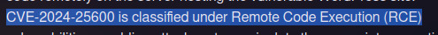
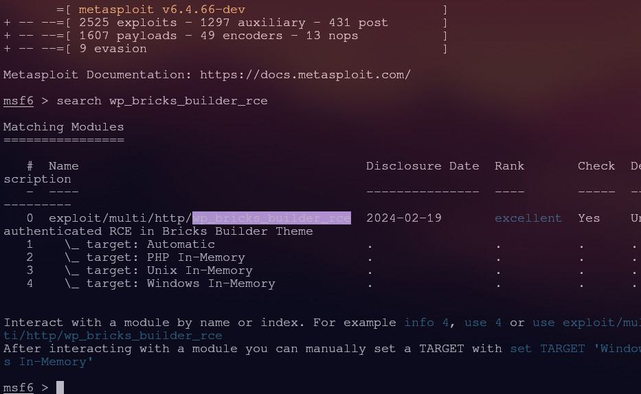
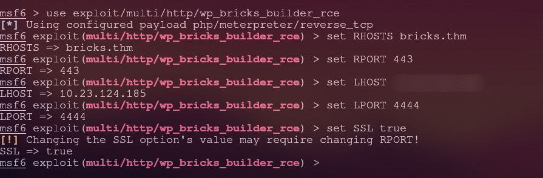
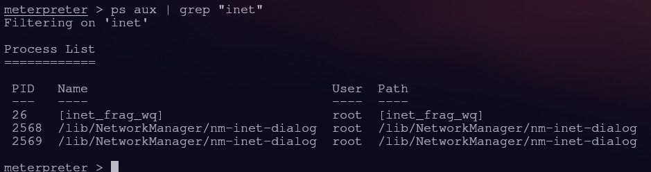
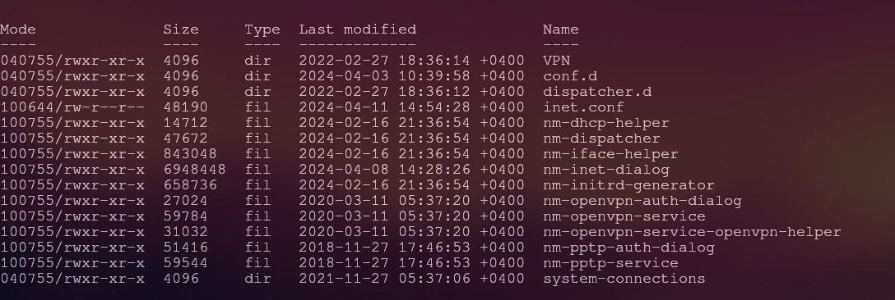

🚨 Bricks Heist – A Digital Crime Investigation
Bricks Heist on TryHackMe isn't just another room — it's a full-on cybercrime case. The mission? Investigate the compromise of Brick Press Media Co.’s infrastructure, uncover the attack vector, trace the malware, and ultimately identify the culprit behind the scenes. Let’s dive into this cyber whodunit.
👥 Teamwork Makes the Dream Work
This investigation was carried out by me and my friend enkrat — a fellow cyber security enthusiast  with sharp instincts and a passion for justice in the digital world.
🔍 Step 1 – Port Scanning
We kicked off our recon with a custom Python port scanner. It didn't take long to uncover that bricks.thm was exposing three open ports to the world:
Port 22 (SSH)
Port 443 (HTTPS)
Port 3306 (MySQL)

 
🧭 Step 2 – WordPress Plugin Discovery & Vulnerability Detection
Digging into the website’s source code, we discovered a hidden WordPress instance. Running wpscan, we found that while the WordPress version itself wasn’t vulnerable, it was using an outdated plugin — specifically one affected by CVE-2024-25600, a critical vulnerability that allows remote code execution (RCE).

 
💥 Step 3 – Gaining RCE via Metasploit
We fired up msfconsole, found an appropriate exploit module for CVE-2024-25600, configured the necessary options, and launched the attack.

  
Boom — we had remote shell access.
🕵️ Step 4 – Suspicious Files and Flag Discovery
Inside the compromised system, we found a file with a very interesting name — clearly the flag.
We also ran ps aux to check for any strange processes, and lo and behold — we spotted something highly suspicious: a miner silently draining system resources.

 
🔎 Step 5 – Tracing the Miner
We tracked the likely source of the miner and began our deep-dive analysis.

 
After digging through a mess of binaries and scripts, we found it.

 
There it was — a full-fledged cryptocurrency miner buried deep in /lib/NetworkManager, trying its best to stay hidden.
🧠 Step 6 – Following the Money
Scrolling through the miner's configuration, we noticed an encrypted string — a wallet address, perhaps?
We passed it through CyberChef, and after some decoding magic, we revealed the real wallet address where the stolen coins were being funneled.
Unfortunately, we cannot reveal the decrypted wallet here, as it contains a flag.
🎯 Final Result – Unmasking the Attacker
All clues led to one name: Ivan Kondratev. Based on our forensic trail, it’s clear that he and his team were behind the installation of the cryptominer on the server.
✅ What We Achieved

✅ Custom Python scan revealed three open ports

✅ Detected vulnerable WordPress version with RCE

✅ Exploited it with Metasploit for shell access

✅ Found the miner process and traced it to its directory

✅ Located encrypted wallet & decoded it using CyberChef

✅ Identified Ivan Kondratev as the attacker
If you liked this write-up, check out my friend enkrat for more investigations and cyber adventures.

Room url : https://tryhackme.com/room/tryhack3mbricksheist
